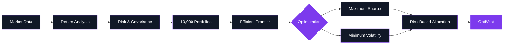

<div align="center">

<a href="https://optivest-psi.vercel.app/">


</a>

<br>


<br><br>

<a href="https://optivest-psi.vercel.app/">

</a>

</div>

<br>

<div align="center">

### **A quantitative portfolio intelligence platform built to turn market data into informed portfolio allocations.**

<br>

`MODERN PORTFOLIO THEORY`   `10,000 SIMULATIONS`   `EFFICIENT FRONTIER`   `MAX SHARPE`   `MIN VOLATILITY`

</div>

<br>

---

<div align="center">

## **THE IDEA**

</div>

<br>

**OptiVest** looks beyond individual stock performance.

Instead of asking:

> *Which stock performed better?*

OptiVest explores:

> **How should a collection of assets be allocated to create a portfolio with a desired risk-return profile?**

It brings historical market data, statistical analysis, portfolio simulation and numerical optimization together inside a single interactive experience.

---

<div align="center">

## **FROM MARKET DATA TO PORTFOLIO**



</div>

---

<div align="center">

# **THE EXPERIENCE**

</div>

<table>
<tr>
<td width="50%" valign="top">

### `01` — Explore

Select and analyze a curated set of stocks through a clean financial dashboard.

</td>

<td width="50%" valign="top">

### `02` — Simulate

Generate **10,000 portfolio combinations** and evaluate their risk-return characteristics.

</td>
</tr>

<tr>
<td width="50%" valign="top">

### `03` — Optimize

Identify mathematically optimized portfolios using constrained numerical optimization.

</td>

<td width="50%" valign="top">

### `04` — Understand

Visualize the efficient frontier and compare portfolio characteristics through an interactive interface.

</td>
</tr>
</table>

---

<div align="center">

## **BUILT AROUND FOUR CORE SIGNALS**

<br>

<table>
<tr>

<td align="center" width="25%">

### `01`

**RETURN**

Historical performance analysis

</td>

<td align="center" width="25%">

### `02`

**RISK**

Portfolio volatility measurement

</td>

<td align="center" width="25%">

### `03`

**CORRELATION**

Asset relationship analysis

</td>

<td align="center" width="25%">

### `04`

**ALLOCATION**

Portfolio-level optimization

</td>

</tr>
</table>

</div>

---

<div align="center">

# **THE OPTIMIZATION ENGINE**

</div>

<br>

```text
     HISTORICAL DATA
            │
            ▼
      RETURN ANALYSIS
            │
            ▼
     RISK MODELING
            │
            ▼
    ┌─────────────────┐
    │ 10,000 PORTFOLIOS│
    │    SIMULATED     │
    └────────┬────────┘
             │
             ▼
      EFFICIENT FRONTIER
             │
        ┌────┴────┐
        ▼         ▼
   MAX SHARPE   MIN VOL
        │         │
        └────┬────┘
             ▼
      RISK PREFERENCE
             │
             ▼
     PORTFOLIO ALLOCATION
```

<br>

<div align="center">

**The heavy computation stays behind the interface.
The user sees the signal, not the complexity.**

</div>

---

<div align="center">

# **PRODUCT**

<br>

### **Risk. Return. Allocation. — in one view.**

<br>

<a href="https://optivest-psi.vercel.app/">


</a>

<br><br>

**Live:** [optivest-psi.vercel.app](https://optivest-psi.vercel.app/)

</div>

---

<div align="center">

# **ENGINEERING**

</div>

<table>
<tr>
<td width="50%" valign="top">

### Frontend

**React 19**
**Vite**
**Tailwind CSS**
**Recharts**
**Axios**
**Framer Motion**
**Lucide Icons**
**React Hook Form**

</td>

<td width="50%" valign="top">

### Backend

**FastAPI**
**Python**
**NumPy**
**Pandas**
**SciPy**
**Scikit-learn**
**yfinance**
**ReportLab**

</td>
</tr>
</table>

<br>

<div align="center">


</div>

---

<div align="center">

# **BUILT FOR THE REAL WORLD**

### even when the network isn't perfect.

</div>

OptiVest uses **Yahoo Finance through `yfinance`** for market data.

When live market data cannot be retrieved, the backend falls back to a **seeded synthetic data source** so that the application remains operational during demonstrations.

The application explicitly exposes the simulated-data state rather than silently presenting it as live market information.

```text
              MARKET DATA
                   │
             ┌─────┴─────┐
             │           │
          AVAILABLE   UNAVAILABLE
             │           │
             ▼           ▼
         LIVE DATA   SAFE FALLBACK
             │           │
             └─────┬─────┘
                   ▼
             OPTIMIZATION
                   │
                   ▼
                OPTIVEST
```

---

<div align="center">

# **THE RESULT**

<br>


</div>

---

<div align="center">

# **🏆 1ST PRIZE**

### **CENTRE OF EXCELLENCE HACKATHON**

**Kongu Engineering College**

<br>

OptiVest was developed and presented as a four-member collaborative project and secured **1st Prize** at the Centre of Excellence Hackathon.

</div>

---

<div align="center">

# **THE TEAM**

### Four contributors. One product.

<br>

<table>
<tr>

<td align="center" width="25%">

<a href="https://github.com/Niranjan-g-13012007">

<strong>NIRANJAN G</strong>

</a>

<br><br>

<sub>GitHub Profile ↗</sub>

</td>

<td align="center" width="25%">

<a href="https://github.com/nirmal-kumar-v">

<strong>NIRMAL KUMAR V</strong>

</a>

<br><br>

<sub>GitHub Profile ↗</sub>

</td>

<td align="center" width="25%">

<a href="https://github.com/NITHISH-2207">

<strong>NITHISH</strong>

</a>

<br><br>

<sub>GitHub Profile ↗</sub>

</td>

<td align="center" width="25%">

<a href="https://github.com/pranesh-deepan">

<strong>PRANESH DEEPAN</strong>

</a>

<br><br>

<sub>GitHub Profile ↗</sub>

</td>

</tr>
</table>

<br>

### **Equal Contribution**

All four team members contributed equally to building OptiVest — across **ideation, engineering, optimization, interface design, testing and presentation.**

</div>

---

<br>

<div align="center">


<br><br>

<a href="https://optivest-psi.vercel.app/">


</a>

<br><br>

<sub>Portfolio Risk & Return Intelligence</sub>

</div>
